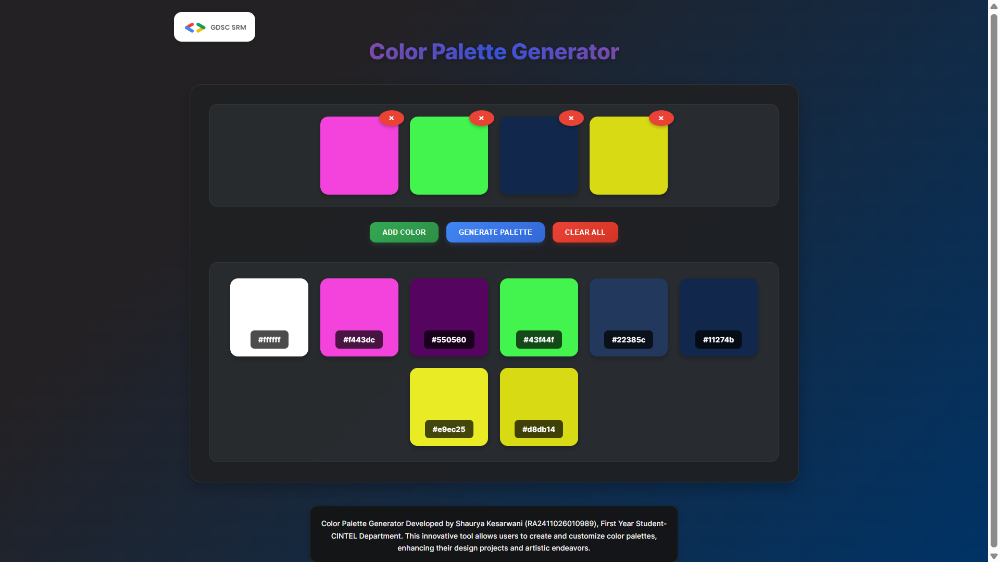

# Color Palette Generator 🎨

A modern, interactive web app to create and customize color palettes for your design projects and artistic endeavors.

## Features

- Add, remove, and customize colors
- Generate beautiful color palettes
- Copy color codes with a click
- Responsive and visually appealing UI

## Demo

### Screenshot



### Video Walkthrough

<video src="https://github.com/Shaurya07dev/GDSC_ColorPalette/raw/main/media/demo.mp4" controls width="700"></video>

> _If the video does not play, [download it here](https://github.com/Shaurya07dev/GDSC_ColorPalette/raw/main/media/demo.mp4)._

## Technologies Used

- React
- CSS3

## How to Run This Project

1. **Clone the repository:**
   ```bash
   git clone https://github.com/Shaurya07dev/GDSC_ColorPalette.git
   cd GDSC_ColorPalette
   ```

2. **Install dependencies:**
   ```bash
   npm install
   ```

3. **Start the development server:**
   ```bash
   npm start
   ```
   The app will open at [http://localhost:3000](http://localhost:3000).

4. **Build for production:**
   ```bash
   npm run build
   ```

## Credits

Developed by Shaurya Kesarwani (RA2411026010989), First Year Student - CINTEL Department.

---

## License

This project is licensed under the MIT License.
